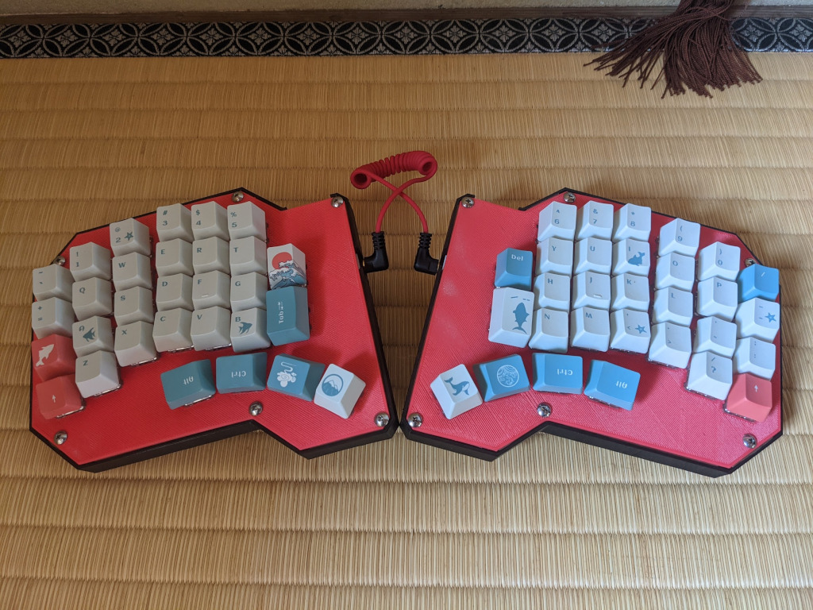

# Musashi60 - Open Hardware Keyboard

## Overview

Musashi60 is open-hardware splitted keyboard.

* Keys: 60
* Layout: Ergonomic column-staggered
* All parts are available to procured or make yourself. see [parts](#parts-list).
* Keyboard Maintainer: [HAMANO Tsukasa](https://github.com/hamano)
* Hardware Supported: The PCBs, controllers supported
* Hardware Availability: Links to where you can find this hardware

Make example for this keyboard (after setting up your build environment):

    make musashi60:default

See the [build environment setup](https://docs.qmk.fm/#/getting_started_build_tools) and the [make instructions](https://docs.qmk.fm/#/getting_started_make_guide) for more information. Brand new to QMK? Start with our [Complete Newbs Guide](https://docs.qmk.fm/#/newbs).

## Gallery

## Parts list

- Pro micro
- PCB
- case
- plate
- screw

## Build guide

Comming soon...
